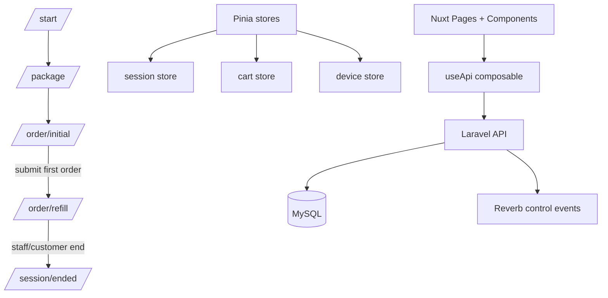

# CASE_FILE.md — GrillPad Frontend Foundation

## Objective
Build a Nuxt 4 tablet PWA frontend foundation that supports a sessioned eat-all-you-can flow with strict initial-order and refill phases.

## Architecture

## Audit Checklist
- [x] Race conditions/Async leaks: no polling, no async mutex, no offline outbox by default.
- [x] State machine/Contract integrity: explicit session phase gates.
- [x] Security/Auth boundaries: token attached in API composable, backend remains source of truth.
- [x] Monorepo/Shared config drift: frontend package isolated for `tablet-ordering-pwa/`.
- [x] Test sufficiency: scripts and strict types included; endpoint tests remain TODO once backend contracts finalize.

## Hard Rules
- Initial order and refill carts are separated.
- Package cannot be changed after initial order.
- Refill route must never display the full initial menu.
- API responses are never cached as truth.
- App updates are deferred during active sessions.
