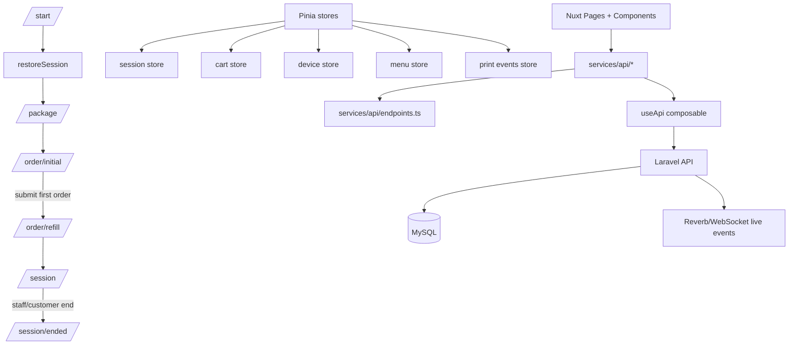

# CASE_FILE.md — GrillPad MVP Tablet Ordering Client

## Objective
Deliver the Nuxt tablet ordering MVP that runs end-to-end with backend-backed session start/restore, initial orders, refill orders, active order visibility, print acknowledgement, and guarded phase routing.

## Architecture

## Audit Checklist
- [x] Race conditions/Async leaks: realtime connection lifecycle is bound to session identity and cleans up on reset.
- [x] State machine/Contract integrity: explicit session phase gates and session-source-of-truth routing.
- [x] Security/Auth boundaries: bearer token injection + 401 invalidation and session reset.
- [x] Monorepo/Shared config drift: work limited to `woosoo-grillpad` frontend package.
- [x] Test sufficiency: targeted tests cover route guards, submission guards, storage parsing, menu/refill rules, and realtime/store helpers.

## Hard Rules
- Initial order and refill carts are separated.
- Package cannot be changed after initial order.
- Refill route must never display the full initial menu.
- API responses are never cached as truth.
- App updates are deferred during active sessions.
- Print events can be acknowledged from the active session screen.
