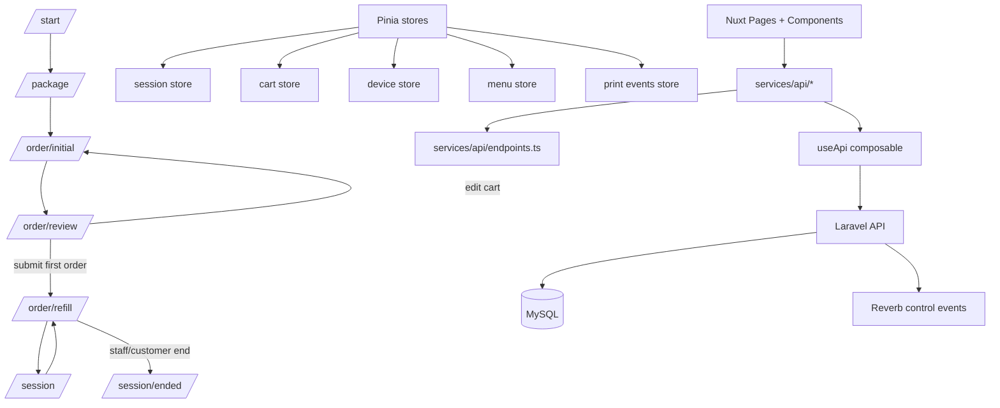

# CASE_FILE.md — GrillPad Frontend Contract Spine

## Objective
Build a Nuxt 4 tablet PWA frontend foundation that supports a sessioned eat-all-you-can flow with strict initial-order, review, and refill phases.

## Current Case Status

This branch tightens the frontend contract layer before deeper UI implementation:

- Adds `docs/woosoo_final_spec.md` as the local source-of-truth contract.
- Adds centralized endpoint constants in `app/services/api/endpoints.ts`.
- Adds device registration, active order, and print event service contracts.
- Promotes `review` into an explicit workflow phase.
- Adds a print events store for printer/relay visibility.

## Architecture

## Audit Checklist
- [x] Race conditions/Async leaks: no polling, no async mutex, no offline outbox by default.
- [x] State machine/Contract integrity: explicit session phase gates, including `review`.
- [x] Security/Auth boundaries: token attached in API composable, backend remains source of truth.
- [x] Monorepo/Shared config drift: frontend changes scoped to `woosoo-grillpad` only.
- [ ] Test sufficiency: next pass should add Vitest coverage for session guard, cart rules, endpoint contracts, and print event store.

## Hard Rules
- Initial order and refill carts are separated.
- Package cannot be changed after initial order.
- Refill route must never display the full initial menu.
- API responses are never cached as truth.
- App updates are deferred during active sessions.
- Route guards must derive navigation from `session.phase`.
- Pages/components must not hardcode API URLs.
- Reverb payloads are hints; API refresh remains the source of truth.
