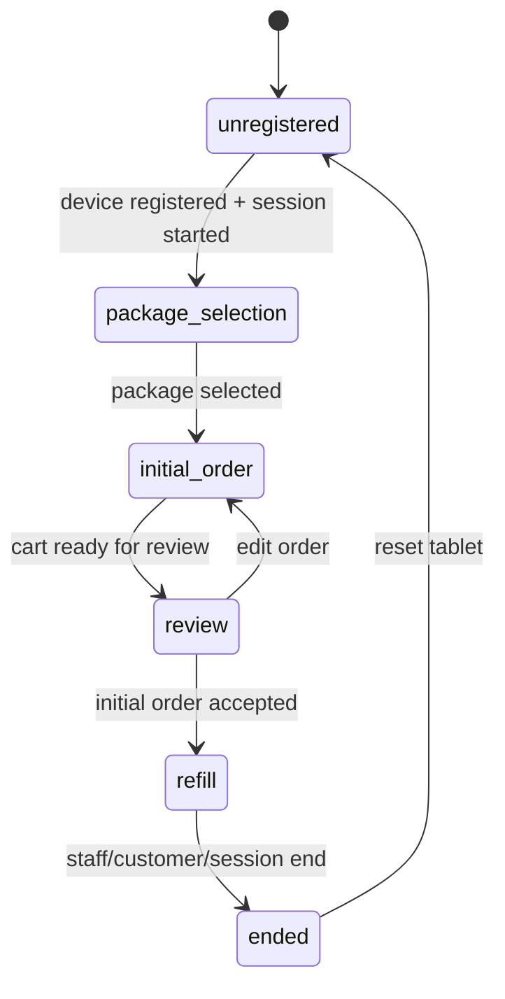

# Woosoo GrillPad Frontend Contract Spec

## Scope

This file is the frontend-side contract spine for `woosoo-grillpad`.

Repository target:

- Nuxt 4.4.x
- Vue 3.5.x
- Pinia 3.x
- Tailwind CSS 4.x
- Zod validated API services
- PWA prompt updates

This repository owns only the tablet PWA. Backend Laravel work belongs in `woosoo-app`.

## Product Model

GrillPad is a sessioned eat-all-you-can tablet ordering flow.

The tablet is not an open browsing kiosk. The authoritative workflow state is `session.phase`.

## Session Phases

Allowed phases:

1. `unregistered`
2. `package_selection`
3. `initial_order`
4. `review`
5. `refill`
6. `ended`

Transition rules:



## Hard Workflow Rules

- `session.phase` is the source of truth.
- Pages must not own business rules.
- Components must not call raw fetch.
- API routes live in `app/services/api/endpoints.ts`.
- API response parsing belongs in `app/services/api/*`.
- Route access belongs in `useSessionGuard()` and `app/middleware/session-phase.ts`.
- Stores own workflow mutations.
- Backend remains the final validator for auth, phase, and refill eligibility.

## Device Registration

The frontend must support:

- QR token scan later
- manual 6-digit token fallback now
- existing `security_code` fallback if backend supports it
- token persistence after successful registration
- session restoration on refresh
- invalid/expired token recovery back to `/start`

Endpoint:

```txt
POST /devices/register
```

Payload examples:

```json
{ "token": "123456" }
```

```json
{ "security_code": "123456" }
```

Response shape:

```json
{
  "success": true,
  "device": {
    "id": "123",
    "name": "kiosk-5"
  },
  "token": "bearer-token",
  "table": {
    "id": "5",
    "name": "Table 5"
  },
  "broadcasting": {
    "key": "app-key",
    "host": "127.0.0.1",
    "port": 8080,
    "scheme": "ws"
  }
}
```

## API Endpoint Map

The frontend must use `API_ENDPOINTS` from `app/services/api/endpoints.ts`.

Current contract map:

```ts
API_ENDPOINTS.device.register
API_ENDPOINTS.session.start
API_ENDPOINTS.session.current
API_ENDPOINTS.menu.packages
API_ENDPOINTS.menu.initial
API_ENDPOINTS.menu.refill
API_ENDPOINTS.orders.initial
API_ENDPOINTS.orders.refill
API_ENDPOINTS.orders.active
API_ENDPOINTS.printEvents.list
API_ENDPOINTS.printEvents.acknowledge(eventId)
```

If backend routes change, update only `endpoints.ts` and the matching Zod schemas.

## Initial Order Rules

During `initial_order` and `review`, the customer may:

- view package-linked initial menu
- add package-allowed initial items
- add initial modifiers and sides
- review the cart
- submit the first order

After first-order success:

- call `session.markInitialOrderSubmitted(orderId)`
- clear the initial cart
- enter `refill`
- route to `/order/refill`

## Refill Rules

After the initial order is submitted, the tablet becomes a refill interface.

Allowed during refill:

- backend-approved refillable sides
- backend-approved refillable modifiers
- allowed refill extras explicitly marked refillable

Forbidden during refill:

- changing package
- reopening package selection
- reopening full initial menu
- adding non-refillable items
- showing premium/initial-only menus as interactive UI

Refill menu must come from the backend-approved refill endpoint, not from client-side filtering of the full initial catalog.

## Cart Rules

The cart store owns cart destination.

- `initialCart` is used before first order submission.
- `refillCart` is used after first order submission.
- initial cart clears after successful initial submission.
- refill cart clears after successful refill submission.
- both carts clear on session end/reset.

UI must call `cart.add(item)` and let the store validate the active phase.

## Reverb Events

Reverb is a control/update channel only.

Useful event names:

- `order_created`
- `order_refilled`
- `order_acknowledged`
- `print_event_created`
- `print_event_updated`
- `refresh_refill_menu`
- `force_end_session`
- `show_notice`
- `refill_locked`
- `refill_unlocked`

Rules:

- subscribe only after device/session identity exists
- unsubscribe on reset/session end
- avoid duplicate event handlers after route changes
- re-fetch authoritative state after event receipt
- never trust event payloads as full source of truth

## PWA Update Rules

- PWA updates are prompt-based.
- Do not force update during active ordering.
- Defer update application until session is inactive or ended.
- API routes are NetworkOnly in the service worker.
- API cache is never session truth.

## Audit Checklist

- [ ] Race conditions/async leaks checked
- [ ] State machine/contract integrity checked
- [ ] Security/auth boundaries checked
- [ ] Monorepo/shared config drift checked
- [ ] Test sufficiency checked
